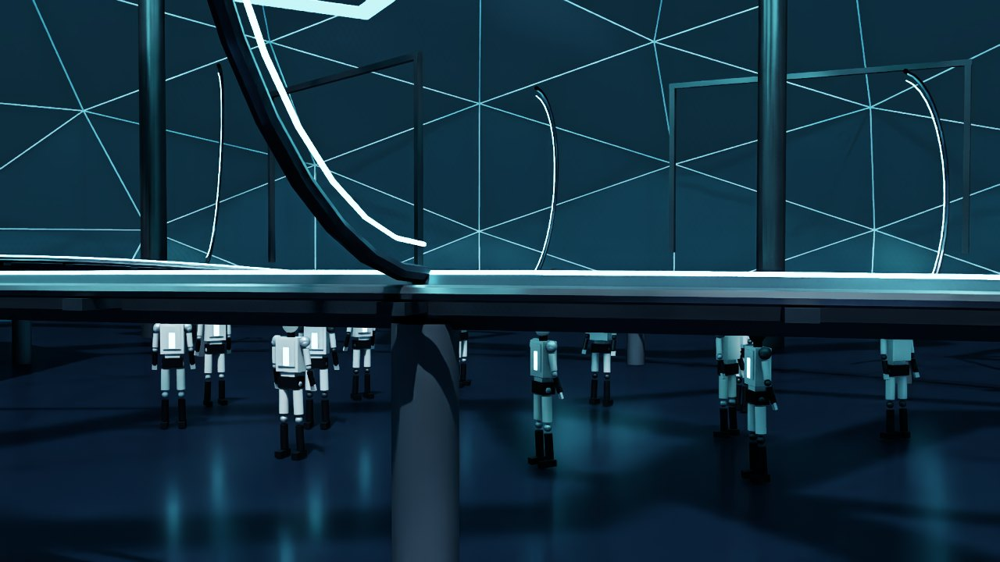
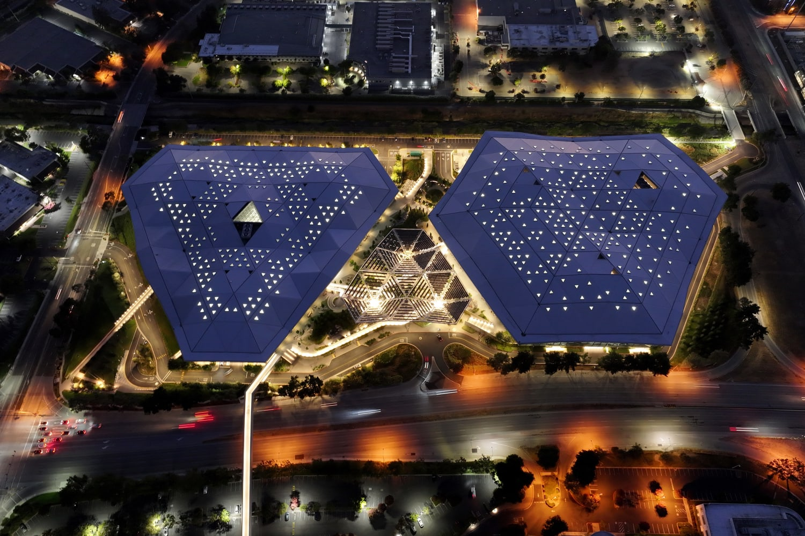
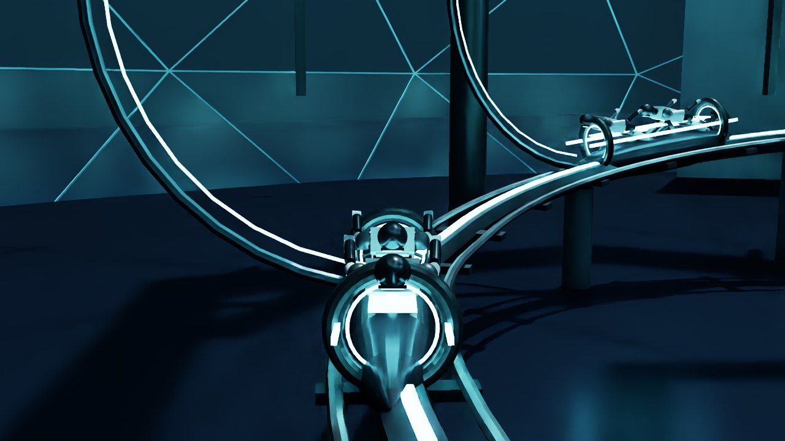
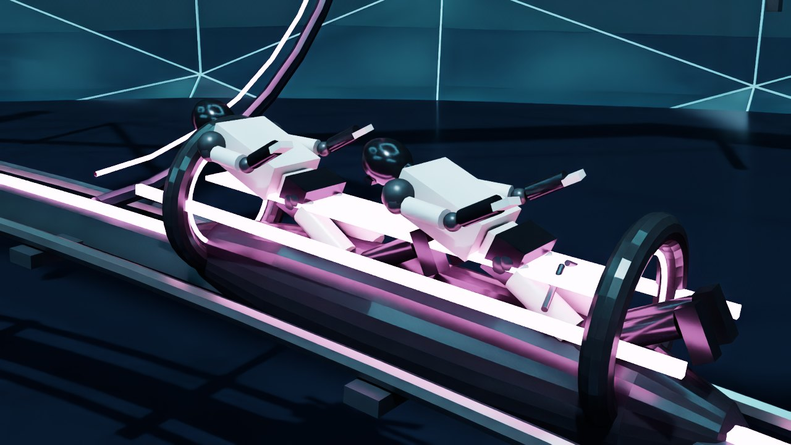
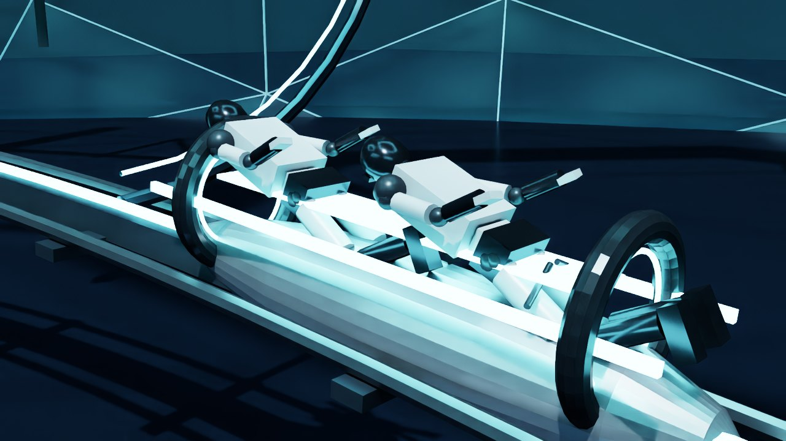
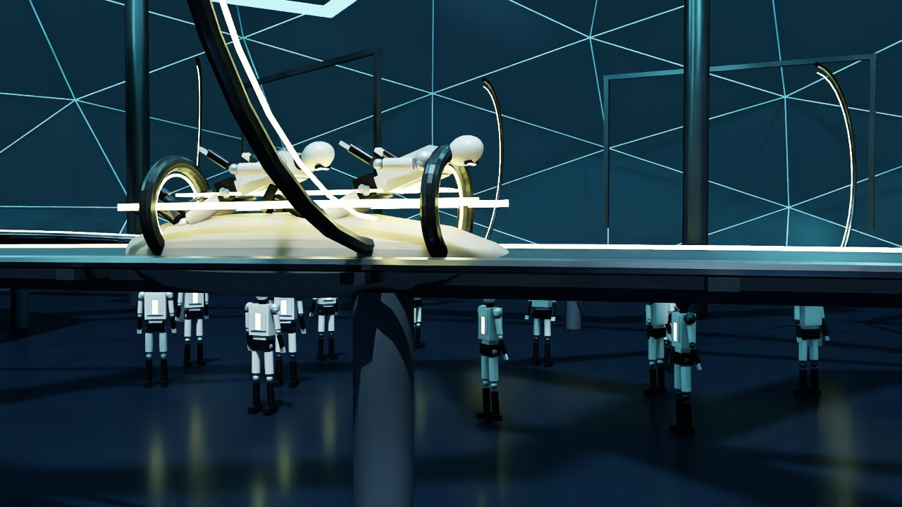
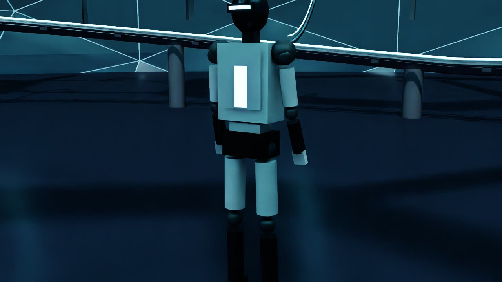
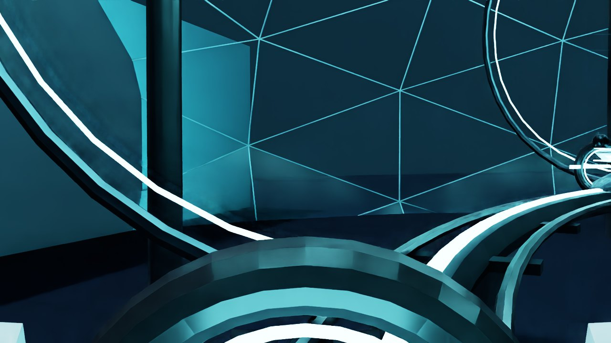

# Cudacycle

Cudacycle is a digital twin of a campus commute: humanoid riders on a lightcycle-style path through an NVIDIA HQ–style courtyard. The courtyard is OpenUSD. ovrtx draws it. ovphysx steps a wheel. `ui/` is the configurator.

The idea came from **TRON Lightcycle / Run** and **NVIDIA headquarters**: motion under a canopy, on a track, through a campus. What if that courtyard had to move a humanoid fleet?






## Plan

| Phase | What got built |
| --- | --- |
| 1. Courtyard | OpenUSD stage: campus, track, fleet, cameras, lights |
| 2. Parts | Meshy for some parts, exported as GLB. The live USDA does not import those files. The rest of the courtyard was generated in USD |
| 3. Variants | Finish, light, and rider as OmniPBR + UsdPreviewSurface writes |
| 4. Physics | A second stage: one wheel on a rail. Remaining useful life from that spin |
| 5. Servers | ovrtx streams the courtyard JPEG. ovphysx steps the wheel |
| 6. Configurator | React app. Viewport is the JPEG. Launch ride talks to both servers |
| 7. Launch | Four processes on Brev so the twin can be recreated |

Rider, light, and finish are close-ups on the same prims:









---

## The React view

`ui/` is a Vite app on `:5173`. It is a configurator, not a renderer. The courtyard is an `` of an ovrtx JPEG. Vite proxies the two backends so the browser only talks to one origin:

```
browser  :5173
   /api          →  ovrtx    127.0.0.1:8791
   /physics      →  ovphysx  127.0.0.1:8793
```

| UI action | Where it goes | What happens |
| --- | --- | --- |
| Viewport | `GET /api/frame.jpg` | ovrtx returns the `/Render/Camera` `LdrColor` JPEG. The configurator polls it. |
| ovrtx badge | `GET /api/status` | Live when `"live"` and `"state": "rendering"`. If idle, the configurator `POST`s `/api/render/start`. |
| Finish / light / rider / camera | `POST /api/control` | ovrtx writes OmniPBR + UsdPreviewSurface inputs, or the `Live` camera xform, on the visual USDA. |
| Launch ride | `POST /api/control` and `POST /physics/api/control` | ovrtx writes cycle and `Live` camera xforms each frame. ovphysx drives the wheel. |
| Wheel rpm | `GET /physics/api/status` | From the solved omega. Speed shown while riding is `118`. Not a solve. |
| Remaining useful life | `GET /physics/api/status` | Wear integrates from omega (`0.018 / s` at drive rate). The configurator shows `(1 - wear)` as a percent. |
| Motor temp, chassis load | (none) | Formulas in the configurator from speed and wear. Not a solve. |

Remaining useful life is not a second courtyard and not a timer in React. ovphysx writes a drive rate onto the wheel, steps PhysX, and reads omega back. RPM is that omega. Wear adds from it (`0.018 / s` at drive rate). Remaining useful life is `1 - wear`. A clock in the UI would keep ticking if the solve stalled. This number follows omega. It is not a fatigue model.

If ovrtx is down, `/api` is 502 and the viewport waits. If ovphysx is down, the numbers wait. The configurator does not invent a local scene.

That viewport is this JPEG — Overview, Follow, Cabin:




---

## The USDA

`assets/cudacycle_visual.usda` is the courtyard stage. Default prim `World`. Y-up, meters. No payload GLBs. The file also has 192 samples at 24 fps (one lap). The live ride does not play that clip. The ovrtx server writes `/World/Cudacycle` and `/World/Cameras/Live` each frame.

| Branch | Prim types | What is there |
| --- | --- | --- |
| `/World/Looks` | `Scope`, `Material`, `Shader` | Each look is OmniPBR + UsdPreviewSurface (diffuse, metallic, roughness) |
| Campus | `Cube`, `Mesh`, `Cylinder`, `Xform` | Ground, geodesic canopy, hexes, Endeavor, Voyager, columns, portals |
| Track | `Mesh`, `Cube`, `Cylinder`, `Xform` | Spine, glow, rails, ties, posts, 10 arches |
| Fleet | `Xform`, `Mesh`, `Cube`, `Cylinder`, `Sphere` | `Cudacycle`, `CompanionA`, `CompanionB` (offset on the lap), 2 riders each, 12 plaza humanoids, 1 offstage rider |
| Lights | `DomeLight`, `DistantLight`, `SphereLight` | Dome, key, four fills. `CycleFill` follows the lead cycle |
| `/World/Cameras` | `Camera` | Seven cameras. See below |
| `/Render/Camera` | `RenderProduct` + `RenderVar` | 1280×720, `LdrColor`, camera = `Live`. ovrtx needs this pair |

| Camera | Kind | Role |
| --- | --- | --- |
| `Hero` | Static | Courtyard overview |
| `Chase` | Time-sampled in the file | Follow path. Live Follow writes the same offsets onto `Live` |
| `Cockpit` | Time-sampled in the file | Cabin path. Live Cabin writes the same offsets onto `Live` |
| `Live` | Written by the ovrtx server | What ovrtx actually draws |
| `StudioFinish` | Static | Build-step close-up |
| `StudioLight` | Static | Build-step close-up |
| `StudioRider` | Static | Build-step close-up |

`assets/cudacycle_physics.usda` is a second stage: `PhysicsScene`, rail `Cube`, wheel `Xform` + `Cylinder` collider. No courtyard.

| Still | Source |
| --- | --- |
| `docs/campus.jpg` | Night aerial photograph of headquarters |
| `docs/cam-hero.jpg` | ovrtx JPEG, Overview |
| `docs/cam-chase.jpg` | ovrtx JPEG, Follow |
| `docs/cam-cockpit.jpg` | ovrtx JPEG, Cabin |
| `docs/studio-rider.jpg` | ovrtx JPEG, Rider step |
| `docs/studio-light.jpg` | ovrtx JPEG, Light step |
| `docs/studio-finish.jpg` | ovrtx JPEG, Finish step |
| `docs/variant-carbon.jpg` | ovrtx JPEG, carbon finish + yellow light |
| `docs/stage-courtyard.jpg` / `stage-fleet.jpg` / `stage-cycle.jpg` | Earlier ovrtx stills of the same stage |

Those three stage stills are the same path as the configurator: visual USDA, `DISPLAY=:0`, `/Render/Camera` → `LdrColor` on the L40S. First compile is slow. After that it is just `/api/frame.jpg`.

---

## Recreate it

This is how I ran it: Brev launchable **isaac-lab-2-3-2-with-isaac-sim-5-1-0** on one L40S. A laptop cannot draw the stage. Clone to `/tmp/cudacycle` (the container sees `/workspace/tmp/cudacycle`). Run these on the **host**.

```bash
git clone <this-repo-url> /tmp/cudacycle
cd /tmp/cudacycle
bash scripts/setup_brev.sh
bash scripts/setup_physx.sh
```

Then four processes (separate terminals):

```bash
bash scripts/start_physics_server.sh
```

```bash
docker exec -e DISPLAY=:0 isaac-lab-ex-ros2-isaac-sim-ex-1 \
  bash /workspace/tmp/cudacycle/scripts/start_gpu_server.sh
```

```bash
bash scripts/start_host_proxy.sh
```

```bash
cd ui && npm install && npm run dev
```

Open `http://127.0.0.1:5173`. First RTX frame can take a minute (`"state": "first-frame"`). Leave ports `49100`, `47998`, and `8210` off.

To use the configurator on a laptop, keep those processes on Brev and tunnel the APIs:

```bash
ssh -L 8791:127.0.0.1:8791 -L 8793:127.0.0.1:8793 <brev-host>
cd ui && npm install && npm run dev
```

Without the tunnels, `/api` is 502 and the viewport stays blank.

---

## Repo

| Path | Role |
| --- | --- |
| `assets/cudacycle_visual.usda` | Courtyard stage |
| `assets/cudacycle_physics.usda` | Wheel proxy |
| `assets/meshy/` | Prompts + hull GLB. Look-dev only. Not referenced by the live USDA |
| `docs/` | Stills |
| `ui/` | Configurator |
| `server/ovrtx_server.py` | JPEG + control on `:8791` |
| `server/ovphysx_server.py` | Wheel omega, wear, remaining useful life on `:8793` |
| `scripts/setup_*.sh` / `start_*.sh` | Venvs and the four processes |
| `scripts/nvidia_icd_egl.json` | Vulkan ICD for `libEGL_nvidia` |

`inspo/` and `preview/` (hero plate, score, VO, reference footage) stay on this laptop. They are gitignored.

`npm install` and the setup scripts recreate `ui/node_modules` and the venvs.
